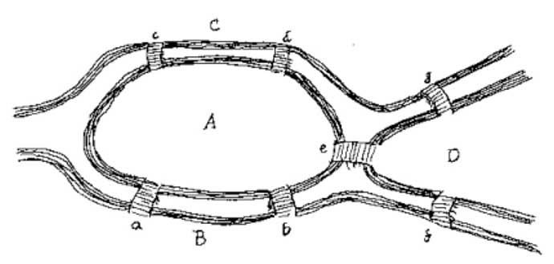

# Broarna i Königsberg
Den lilla staden Königsberg ligger idylliskt på båda sidor om floden Pregel. Mitt i floden ligger en större och en mindre ö, och redan i början av 1500-talet lät borgmästaren bygga sju broar som förband öarna med stränderna på båda sidor, enligt bilden nedan. Königsbergs invånare uppfann snabbt en tävling: man skulle promenera över broarna så att man endast en gång passerade varje bro. I flera år försökte mer eller mindre kluriga stadsborgare att lösa problemet men ingen lyckades hitta en väg utan att minst en bro passerades två gånger. Det hela blev olöst ända till 1735, då den berömde schweiziske matematikern Leonard Euler besökte staden. Den dåvarande borgmästaren förklarade tävlingen för stadens celebre gäst som inte behövde särskilt lång tid på sig för att finna en lösning. 

Vilket svar lämnade Euler? Går det eller går det inte att göra en promenad enligt tävlingsreglerna? Man kan givetvis förenkla problemet med hjälp av en båtfärd över floden, men den lösningen var inte giltig, enligt Königsbergarna. 

